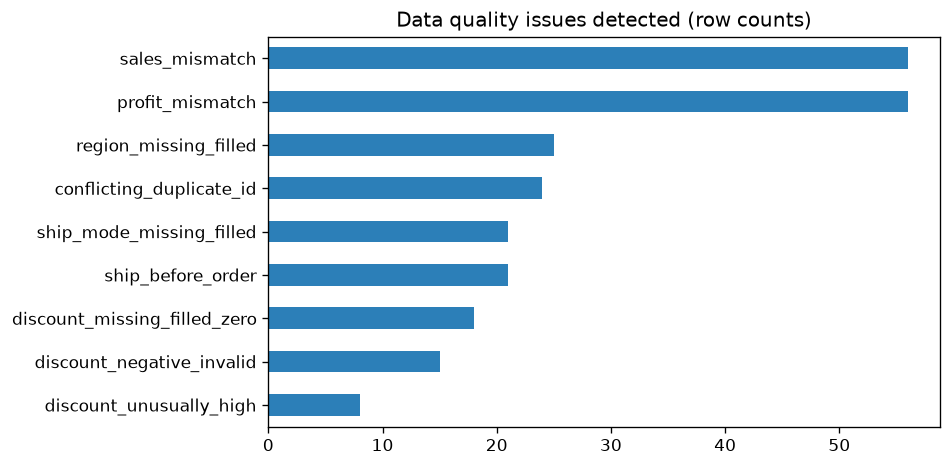

<div align="center">

# 🧹 Retail Orders Data Cleaning

**Turning a messy multi-system export into an analysis-ready, fully audited dataset.**

   

<sub>Capstone project for the **BITSoM Business Analytics with Gen & Agentic AI** program.</sub>

</div>



## ⚡ Key results

- **932 → 912 rows** after removing 20 exact duplicates; 4 date formats unified
- **17% of records (156) flagged** for data-quality issues — flagged, not deleted, so every decision is auditable
- **56 sales/profit mismatches** fixed by recomputing from quantity × price × discount
- Technology leads on sales (2.20M) and margin (29.8%); Office Supplies has the thinnest margin

<details>
<summary><b>📘 Full project write-up</b> (problem, data, method, assumptions, limitations)</summary>

# Part 1 - Data Cleaning (Retail Orders)

**Student:** V S Praveen Ganapathiraju  
**Student ID:** 1234  
**Repository:** `vspraveenganapathiraju_1234_part1_data_cleaning`

---

## 1. Business problem
A retail analytics team has exported order records from several source systems into a single
file (`raw_orders.xlsx`). The export is unreliable: inconsistent text, four different date
formats, missing values, malformed discounts, duplicate rows, and sales/profit figures that do
not always reconcile. Leadership cannot trust any KPI, margin, or regional analysis until the
data is cleaned, validated, and documented. **Goal:** deliver an analysis-ready dataset and a
transparent record of every cleaning decision, following the supplied business rules.

## 2. Dataset used
- **File:** `data/raw_orders.xlsx` (instructor-provided, kept unchanged).
  - Sheet `raw_orders`: **932 rows x 21 columns** (order_id, order_date, ship_date, customer_id,
    customer_name, segment, region, state, city, category, sub_category, product_name, ship_mode,
    quantity, unit_price, discount, sales, cost, profit, payment_status, order_status).
  - Sheet `business_rules`: the cleaning rules followed in this project.
- **Cleaned output:** `data/cleaned_orders.xlsx` and `data/cleaned_orders.csv` (912 rows x 28 columns).

## 3. Tools used
- Python 3.14 (pandas, numpy, matplotlib, openpyxl)
- Jupyter Notebook
- See `requirements.txt` for pinned versions.

## 4. Steps performed
1. Profiled the raw data (missingness, duplicates, dtypes).
2. Standardised text - stripped/condensed whitespace and Title-Cased 9 categorical columns.
3. Parsed 4 mixed date formats into proper dates.
4. Cleaned `discount` - converted `%` strings, flagged negatives and unusually-high values,
   filled valid missing values with 0.
5. Filled missing `region` and `ship_mode` with `Unknown` (flagged).
6. Removed 20 exact duplicate rows; flagged conflicting duplicate `order_id`s.
7. Flagged `ship_date` earlier than `order_date`.
8. Created calculated fields: `calculated_sales`, `calculated_profit`, `profit_margin`,
   `shipping_delay_days`, `order_month`, `order_year`, and a consolidated `data_quality_flag`.
9. Built a completed-sales summary (excluding cancelled / returned / failed / refunded orders).
10. Saved cleaned data, a data-quality report, and visual evidence.

Full step-by-step reasoning and counts are in `cleaning_log.md`; the executable analysis is in
`notebooks/part1_data_cleaning.ipynb` (rendered copy: `notebooks/part1_data_cleaning.html`).

## 5. Key outputs
| Output | Location |
|--------|----------|
| Cleaned dataset | `data/cleaned_orders.xlsx`, `data/cleaned_orders.csv` |
| Data quality report (issue counts) | `outputs/data_quality_report.csv` |
| Run summary (all metrics) | `outputs/cleaning_summary.json` |
| Completed sales by category | `outputs/completed_sales_by_category.csv` |
| Charts | `outputs/*.png` |
| Cleaning decisions log | `cleaning_log.md` |

**Headline numbers:** 932 -> 912 rows after removing 20 exact duplicates; 756 rows fully clean,
156 rows carry at least one data-quality flag; 602 completed orders totalling 5,959,649 in sales.

## 6. Business insights
- **17% of records (156/912) carry a data-quality issue.** Data governance at the source
  systems needs attention before this feed can be used for automated reporting.
- **Discount controls are weak:** 15 negative discounts and 8 discounts above 65% indicate
  data-entry errors or unauthorised pricing that inflate/deflate reported sales.
- **Reported figures cannot be trusted blindly:** 56 rows had `sales` (and 56 had `profit`)
  that did not reconcile with `quantity x unit_price x (1 - discount)` - recomputed fields fix this.
- **Profitability (completed orders):** Technology leads on both sales (2.20M) and margin
  (29.8%), followed by Furniture (1.92M, 28.9%); Office Supplies has the thinnest margin
  (1.84M, 27.8%) - a candidate for pricing review.

## 7. Assumptions made
- Dash-separated dates are `DD-MM-YYYY`; slash-separated dates are `MM/DD/YYYY`.
- The highest legitimate discount is 0.65; anything above is "unusually high".
- A missing discount can be set to 0 only when all other sales fields are valid.
- "Completed sales" = `order_status = Completed` AND `payment_status = Paid`.
- Invalid/conflicting rows are **flagged, not deleted**, so analysts can audit them.

## 8. Known limitations
- Negative and unusually-high discounts are flagged but the *correct* values are unknown, so
  affected rows are recomputed with discount treated as 0 - true intent may differ.
- Conflicting duplicate `order_id`s are retained and flagged rather than resolved (no
  authoritative source to choose from).
- Date-format assumption could misread a genuinely ambiguous slash date (none detected here).

## 9. Screenshots
All in `screenshots/`:
- `01_missing_values.png` - missing values in the raw data
- `02_category_standardization.png` - distinct category values before vs after cleaning
- `03_data_quality_flags.png` - frequency of each data-quality issue
- `04_completed_sales_by_category.png` - completed sales by product category
- `05_cleaned_preview.png` - preview of the cleaned dataset

## 10. How to reproduce
```bash
pip install -r requirements.txt
jupyter notebook notebooks/part1_data_cleaning.ipynb   # Run All
```

</details>

---

<div align="center">

By <a href="https://github.com/DrPraveen-BA">Dr Praveen GVS</a> · Part of my <a href="https://github.com/DrPraveen-BA?tab=repositories&q=vspraveenganapathiraju">business analytics capstone series</a> · ⭐ if you found it useful

</div>
